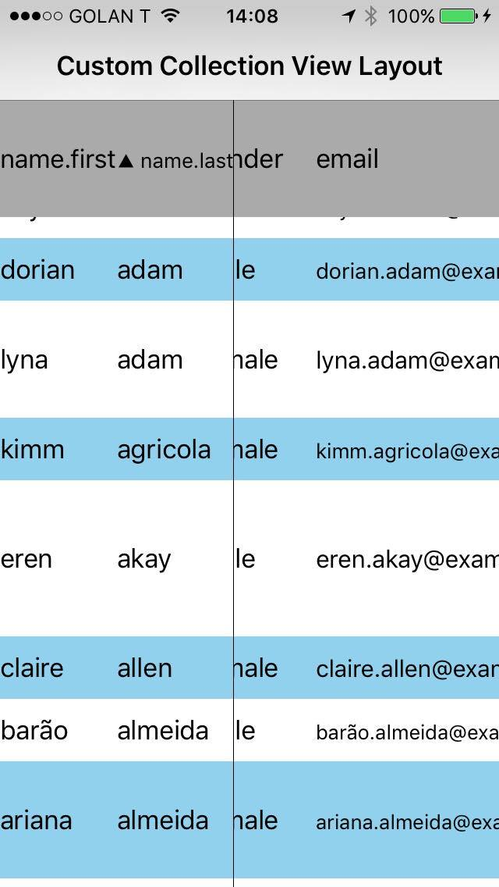

# GridLayoutWithStickyCells

This is a custom UICollectionViewLayout that is designed for displaying tabular data - like a spreadsheet.  Optionally you can pin rows at the top of the table, or columns on the left.

# Configuration
Import the layout class into your ViewController:
'#import "JRGridLayoutWithStickyCellsLayout.h"'

`JRGridLayoutWithStickyCellsLayout* layout = [[JRGridLayoutWithStickyCellsLayout alloc] init];`
`layout.rowsToStickOnTop = 1;` // Adjust this property

`layout.columnsToStickOnLeft = 2;` // Adjust this property

`layout.itemSize = CGSizeMake(75,40);` // This can also be configured dynamically

## Variable row heights and column widths

Row heights and column widths can be configured by implementing the delegate methods in your ViewController class:

```@interface ViewController () <JRGridLayoutWithStickyCellsLayoutDelegate>

// Implement the delegate methods
-(CGFloat) collectionView:(UICollectionView*) collectionView widthForColumAtIndex:(NSInteger) rowIndex {
    if rowIndex == 0 {
      return 60.0f;
     } else {
      return 50.0f;
    }
}

-(CGFloat) collectionView:(UICollectionView*) collectionView heightForRowAtIndex:(NSInteger) sectionIndex {
  if sectionIndex == 0 {
      return 100.0f;
     } else {
      return 80.0f;
    }
}
```


## Screenshot of the example app:

In this example the 2 leftmost columns are always pinned, as well as the first row:

<p align="center">
  
</p>


